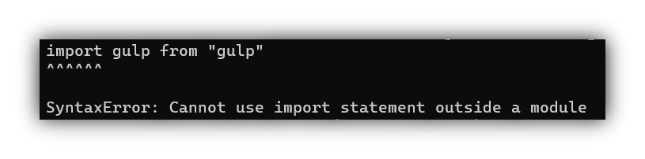

# Troubleshooting

## PSSecurityException on install

When using the CLI, your console displays an error of type **PSSecurityException**. (picture attached)


### Fix PSSecurityException

Open your **PowerShell** **as administrator** and simply enter the following command.

```bash
set-executionpolicy remotesigned
```

## SyntaxError: Cannot use import outside a module

When you launch the bot after an update from a version older than the "Arliming" release, you may need to update the package.json file. This problem is due to a conversion of the module system of bot.ts (from CommonJS to ESModule).



### Fix SyntaxError: Cannot use import outside a module

Just add the `"type": "module",` entry to the package.json file!

## ERR\_MODULE\_NOT\_FOUND on launch

When you launch the bot after an update from a version older than the "Arliming" release, some imports may be obsolete. This problem is due to a conversion of the module system of bot.ts (from CommonJS to ESModule).


### Fix ERR\_MODULE\_NOT\_FOUND

1. Go to the file at this location: `src/app.js` (The second path underlined in red)
2. Search for the module import `src/app.native`(The first path underlined in red)
3. Add `.js` at the end of the import path.


Tip for Jetbrains IDEs

1. Press `ctrl` + `shift` + `R` to open the replacement-tool.
2. Switch to regex mode.
3. Use the two following regex and click on "Replace all" for each.


## My OS replaces the make command in bot.ts with the make command used to build C and C++

Often, on OSX and Linux, the default make command is called instead of make-bot.ts. Here is one of the solutions. to solve this problem.

### Use make-bot.ts from npx

You can use npx to use the desired command without going through the make command of your OS by replacing `make` with `npx make-bot.ts`. For example:



```bash
make bot "my-bot"

make listener "messageCreate" --name "messageCreate.badWords"
```



```bash
npx make-bot.ts bot "my-bot"

npx make-bot.ts listener "messageCreate" --name "messageCreate.badWords"
```


